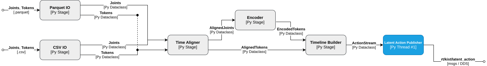

# kist-vla-inference

Python replay publisher streaming SONIC motion tokens to
[kist-gearsonic-inference](https://github.com/Safety-Node/kist-gearsonic-inference)
on the Unitree G1 humanoid robot.

## Architecture

[](docs/kist-vla-inference.svg)

## Dependencies

| Component | Version | Role |
|---|---|---|
| Python | ≥ 3.10 (docker image: 3.12) | runtime |
| numpy, tyro, pyyaml | PyPI | core runtime (installed automatically) |
| `cyclonedds` | 0.10.2, `[dds]` extra | DDS transport — bindings built against a CycloneDDS 0.10.2 core (the robot bus's generation; the 11.x wheel's discovery TypeObject segfaults the 0.10.x receivers). The docker image builds it in a builder stage |
| `pyarrow` | PyPI, `[parquet]` extra | LeRobot training-export episodes |
| `onnxruntime` | PyPI, `[encode]` extra | joint re-encoding (CPU provider — no GPU) |
| `pytest` | `[dev]` extra | tests |
| GEAR-SONIC encoder | HF `nvidia/GEAR-SONIC` | `models/model_encoder.onnx` for `--joints`; pairs with gearsonic's decoder — swap them together |

`requirements.lock.txt` records the exact third-party set this was verified
with (a record, not the install path).

## Installation

#### 1. Clone repository

```bash
git clone https://github.com/Safety-Node/kist-vla-inference.git
cd kist-vla-inference
```

All following steps run from the repository root.

#### Quick Start with Docker

The image bakes in everything below (dependencies, the encoder model, the
repo source) and verifies the import graph + replay test suite at build
time:

```bash
./docker/build.sh      # builds the image (docker build -t kist-vla-inference)
./docker/run.sh        # shell in the container; ready to publish
```

`run.sh` wires `--network host` (CycloneDDS discovery/multicast toward
gearsonic) and mounts `<repo>/shared` for sessions and datasets. The
numbered steps below (2–3) are the manual (non-Docker) alternative.

#### 2. Create the virtualenv

The `cyclonedds` bindings must be built against a 0.10.2 core (no 3.12
wheel; see the Dependencies note):

```bash
git clone --depth 1 -b 0.10.2 https://github.com/eclipse-cyclonedds/cyclonedds.git /tmp/cyclonedds
cmake -S /tmp/cyclonedds -B /tmp/cyclonedds/build \
    -DCMAKE_INSTALL_PREFIX=$HOME/.local/opt/cyclonedds-0.10.2 -DCMAKE_BUILD_TYPE=Release
cmake --build /tmp/cyclonedds/build --target install -j"$(nproc)"

uv venv --python 3.12 && source .venv/bin/activate
CYCLONEDDS_HOME=$HOME/.local/opt/cyclonedds-0.10.2 \
    uv pip install --no-binary cyclonedds -e ".[dds,parquet,encode,vla,dev]"
```

The bindings bake the core's path in at build time, so build them with the
core already at its final location — and pass `--no-cache` when
reinstalling after the core moved (uv would otherwise reuse a wheel built
against the old path).

#### 3. Download the encoder model

```bash
wget -P models https://huggingface.co/nvidia/GEAR-SONIC/resolve/main/sonic_v1_1/model_encoder.onnx
```

## Usage

Set up the config once before running:

- `config/config.yaml` — DDS domain (`dds.domain_id`, 0 = real robot) and
  NIC (`dds.network_interface`, must match the gearsonic side).
- All keys and the replay CLI parameters:
  [docs/configuration.md](docs/configuration.md).

**THE ROBOT MOVES** — with a live gearsonic on the DDS domain, a fresh
token stream switches it to external-token mode. Hang the robot or clear
the area, keep the VR controller in reach (A+B+X+Y held 1s = emergency
stop).

#### Session replay

Replays a [kist-data-collector](https://github.com/Safety-Node/kist-data-collector)
session (`motion_token.csv` + `hand_cmd_{side}.csv`) or a LeRobot
training-export episode — both carry the same quantities:

```bash
# Collector session directory:
python scripts/replay_session.py --path <session-dir>

# LeRobot dataset root + episode index, or the parquet file directly:
python scripts/replay_session.py --path <dataset-dir> --episode 3
python scripts/replay_session.py --path <dataset-dir>/data/chunk-000/episode_000003.parquet
```

#### Joint re-encoding

The recorded tokens are only valid against the collection-time SONIC
checkpoint; `--joints` re-encodes the recording's joints instead, so a
session survives a checkpoint change:

```bash
python scripts/replay_session.py --path <dataset-dir> --episode 1 --joints
```

The deployed checkpoint is SONIC **v1.1** (since 2026-08-31, matching
gearsonic's decoder). Sessions recorded before that date carry
release-checkpoint tokens and MUST be replayed with `--joints`; sessions
recorded against a v1.1 gearsonic replay either way. When the checkpoint
changes again, re-derive the safe standing token too
(`tests/derive_standing_token.py` — update `common/config.py` and
gearsonic's `vla_initial_pose.hpp` together).
